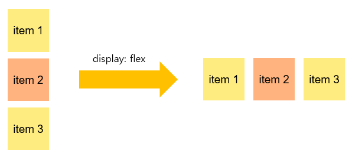
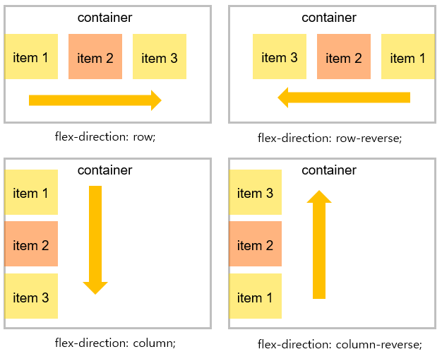
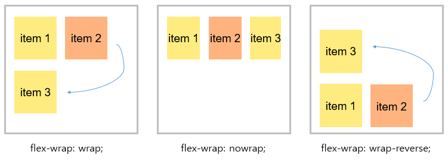
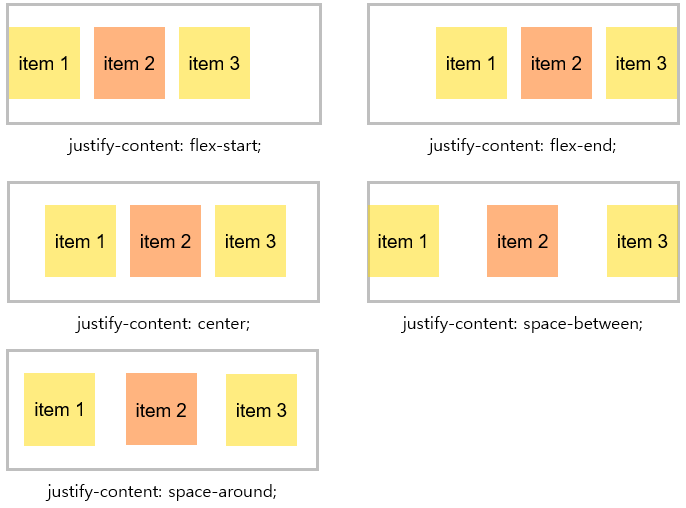
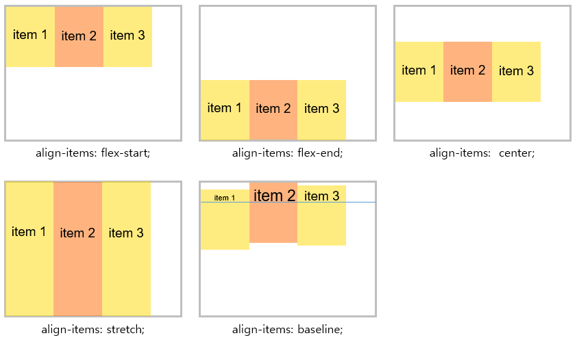
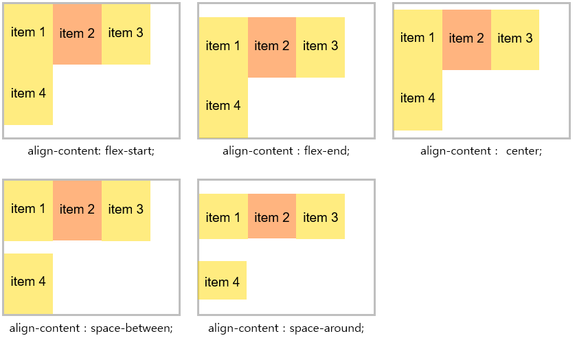

# Flex Box 

Flex Box란 CSS3의 새로운 레이아웃 모드이다.  Flex Box를 사용하면 레이아웃을 유연하게 구현할 수 있다. 

우선 Flex Box를 사용하려면 부모엘리먼트에 `display:flex`를 추가해 **flex container**로 만들어야한다.  아래의 코드에서는 class명이 container인 div가 flex container가 된다. 

```css
.container{ display:flex;}
```

``` html
<div class="container">
   <div class="item">item1</div>
   <div class="item">item2</div>
   <div class="item">item3</div>
</div>
```

container의 item들은 블록요소이기 때문에 기본적으로 수직으로 정렬되어있다.  여기에 container에 `display:flex`를 적용하게 되면 아래그림과 같이 수평 정렬이 된다. 



이렇게 부모 엘리먼트가 flex container가 되면 container내의 하위 엘리먼트들은 flex items가 된다. 


#### Flex Container의 프로퍼티

1. flex-direction

   ``` css
   .container{ 
       display:flex;
       /* 4가지 값을 가질수 있다.*/
       flex-direction: row || column || row-reverse || column-reverse;
   }
   ```

   - row				: item을 **수평방향**으로 **좌에서 우**로 나열함 (기본값)
   - row-reverse  		: item을 **수평방향**으로 **우에서 좌**로 나열함
   - column			: item을 **수직방향**으로 **상에서 하**로 나열함
   - column-reverse	: item을 **수직방향**으로 **상에서 하**로 나열함

   

   


2. flex-wrap

   ```css
   .container{ 
       display:flex;
       /* 3가지 값을 가질수 있다.*/
       flex-wrap: wrap || nowrap || wrap-reverse; 
   }
   ```

   - wrap 			:  container의 폭이 item보다 작아질 경우 다음줄에 item을 표시함
   - nowrap 			:  container의 폭이 item보다 작아질 경우에도 한줄에 item을 표시함 (기본값)
   - wrap-reverse		:  container의 폭이 item보다 작아질 경우 item을 역방향으로 줄바꿈을 함


   


3. justify-content

   item들을 수평방향으로 정렬하는 방법이다. 

   ``` css
   .container{ 
       display:flex;
       /* 5가지 값을 가질수 있다.*/
       justify-content: flex-start || flex-end || center || space-between || space-around; 
   }
   ```

   - flex-start		:  item을 왼쪽으로 정렬 (기본값)

   - flex-end			:  item을 오른쪽으로 정렬

   - center			:  item을 가운데로 정렬

   - space-between	:  첫번째와 마지막 item을 끝에 붙이고 가운데 있는 item들을 일정한 간격으로 정렬

   - space-around	:  모든 item을 일정한 간격으로 정렬

     

   


4. align-items

   item들을 수직방향으로 정렬하는 방법이다.

   ``` css
   .container{ 
       display:flex;
       /* 5가지 값을 가질수 있다.*/
       align-items: flex-start || flex-end || center || stretch || baseline; 
   }
   ```

   - flex-start	: item을 상단에 정렬함
   - flex-end		: item을 하단에 정렬함
   - center		: item을 수직방향의 가운데에 정렬함
   - stretch		: item을 container의 높이와 동일하게 상하로 늘림 (기본값)
   - baseline		: item을 baseline으로 정렬함


   


5. align-content

   item이 여러줄로 표시될 때 수직방향 정렬방법

   ```css
   .container{ 
       display:flex;
       flex-wrap: wrap;
       /* 5가지 값을 가질수 있다.*/
       align-items: flex-start || flex-end || center || space-between || space-around; 
   }
   ```

   - flex-start		:  여러줄의 item을 상단에 정렬함 (기본값)
   - flex-end			:  여러줄의 item을 하단에 정렬함
   - center			:  여러줄의 item을 수직방향의 중앙에 정렬함
   - space-between	:  첫번째 줄과 마지막 줄을 하단에 붙이고 나머지는 일정한 간격으로 수직 정렬함. 
   - space-around	:  모든 줄을 일정한 간격으로 수직 정렬함.


   


