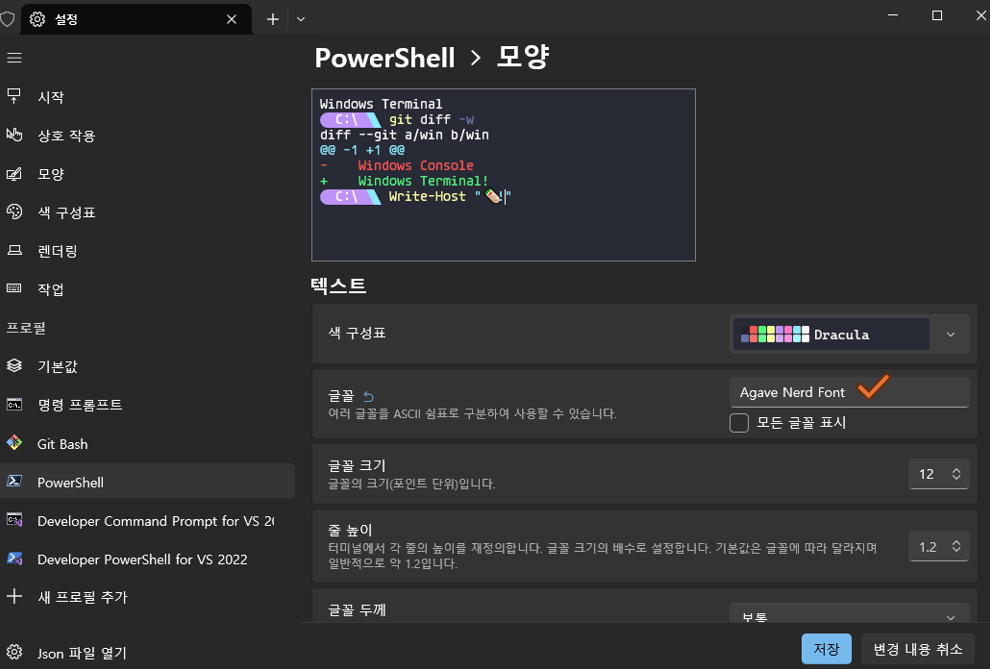

# Windows 터미널에 Oh My Posh 적용하기

### 준비
1. Windows 터미널 ([🔗링크](https://apps.microsoft.com/detail/9n0dx20hk701?hl=ko-kr&gl=KR))
2. Nerd Fonts ([🔗링크](https://www.nerdfonts.com/font-downloads))

Windwos 터미널은 앱스토어에서 간단하게 설치 가능!  
Nerd Fornts는 Oh My Posh에서 사용하는 아이콘이 제대로 표시되도록 설치가 필요하다. 위 사이트에서 원하는 폰트를 다운로드 받고 설치하면 된다. (나는 Agave Nerd Font를 설치했음 😁)

### Windows 터미널 설정하기

1. 터미널 실행
2. 설정 > 프로필 > PowerShell > 추가 설정 > 모양 > 글꼴에서 위에서 다운로드 받은 폰트 선택!
    

### Oh My Posh 설치하기

1. PowerShell을 열고 아래 명령어 실행
```powershell
Set-ExecutionPolicy Bypass -Scope Process -Force; Invoke-Expression ((New-Object System.Net.WebClient).DownloadString('https://ohmyposh.dev/install.ps1'))
```

### PowerShell에 적용하기
PowerShell에서 Oh My Posh 테마를 적용하려면 $PROFILE 파일에 설정을 추가해야한다.

1. **관리자 권한으로 PowerShell 열기**
2. **$PROFILE 파일 열기**

    ```powershell
    notepad $PROFILE
    ```
    - 만약 에러 메세지가 나타난다면 $PROFILE 파일이 없는 상태! 
    - $PROFILE 파일이 없다면 아래 명령어 실행
      ```powershell
      New-Item -Path $PROFILE -Type File -Force
      ```
    - 다시 $PROFILE 파일 열기
      ```powershell
      notepad $PROFILE
      ```
3. **설정 파일에 Oh My Posh 초기화 코드 추가**
    ```powershell
    oh-my-posh init pwsh --config '[로컬에 설치된 테마파일 경로]' | Invoke-Expression
    ``` 
    예시
    ```powershell
    oh-my-posh init pwsh --config 'C:\Users\YourName\AppData\Local\Programs\oh-my-posh\themes\dracula.omp.json' | Invoke-Expression
    ```
    Oh My Posh 테마는 (https://ohmyposh.dev/docs/themes
    ) 에서 확인 가능함 (나는 dracula 테마를 선택했음 😀)

4. **PowerShell 재시작**

### Git Bash에 적용하기

1. Git Bash 실행
2. Git Bash에서 홈 디렉토리로 이동
    ```bash
    cd ~
    ```
3. `.bashrc` 파일 열기
    ```bash
    ls -a
    ```
    - 결과에 `.bashrc`가 보이지 않으면 새로 생성! 
      ```bash
      touch ~/.bashrc
      ```
    - `.bashrc` 파일 열기
      ```bash
      nano ~/.bashrc
      ```
4. Oh My Posh 초기화 코드 추가
    ```bash
    eval "$(oh-my-posh init bash --config 'C:\Users\User\AppData\Local\Programs\oh-my-posh\themes/dracula.omp.json')"
    ```
    - 저장 후 종료
      - `Ctrl + O` → `Enter` → `Ctrl + X`로 저장 후 종료
5. 변경 사항 적용
    ```bash
    source ~/.bashrc
    ```