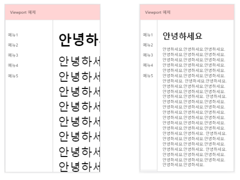

# 뷰포트 (Veiwport)

뷰포트란 사용자가 시각적으로 볼 수 있는 웹페이지 영역을 말한다.  다양한 기기에 최적화된 페이지를 만드려면 head에 meta viewport 태그를 넣어줘야한다. 

``` html
<meta name="viewport" content="width=device-width, initial-scale=1">
```

1. viewport의 속성

   | 속성          | 내용                                                         |
   | ------------- | ------------------------------------------------------------ |
   | width         | viewport의 가로 크기를 지정함. 숫자값이나 device-width등과 같이 특정값을 지정할 수 있음. |
   | height        | viewport의 세로 크기 지정                                    |
   | initial-scale | 페이지가 로딩될 때 화면의 배율을 조정함.                     |
   | minimum-scale | viewport의 최소 크기 설정 (기본값: 0.25)                     |
   | maximum-scale | viewport의 최대 크기 설정 (기본값:1.6 )                      |
   | user-scalable | 사용자 디바이스의 확대기능 사용 유무                         |

   

`width=device-width`은 뷰포트의 너비를 디바이스 너비에 맞춰 표시하라는 의미이다. 모바일 화면에서 viewport의 width속성에 device-width을 지정한것과 안한것의 차이는 아래 그림과 같다. 



첫번째 그림은 width속성을 지정하지 않은 것이고 두번째 그림은 `width=device-width` 라고 지정한 것 이다.


