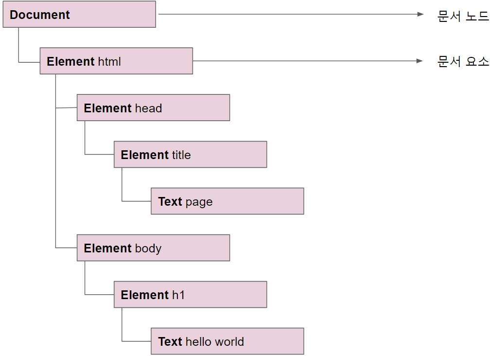

# DOM (Document Object Model)


#### 노드의 계층구조

```html
<html>
    <head>
        <title>page</title>
    </head>
    <body>
        <h1>
            Hello World!
        </h1>
    </body>
</html>
```

위의 HTML 문서를 계층 구조로 표현하면 아래의 그림과 같다.




- **문서노드(document)** 의 자식은 `<html>` 요소 하나뿐이다. 이를 문서요소라고한다. 
- **문서요소(html)** 은 문서의 최상위 요소이며 다른 요소는 모두 이 안에 존재한다. HTML 페이지에서의 문서요소는 항상 `<html>` 요소 이다.


#### Document 타입

자바스크립트는 문서 노드를 Document 타입으로 표현함. Document 객체를 이용해 html의 구조등을 조작할 수 있다.


- 문서에 대한 정보 얻기

  ``` javascript
  var doctype = document.doctype; 	// <!DOCTYPE>에 대한 정보 리턴
  var body = document.body;      		// <body> 노드를 리턴한다. 
  var title = document.title; 		// <title> 요소의 Text를 가져옴.
  var domain = document.domain;        // domain 정보 가져옴
  var url = document.url				// url 정보 가져옴
  ```


- 요소 선택하기

  ``` html
  <script>
      // id가 p-title인 요소를 반환
      // 존재하지 않으면 null을 반환함.
  	var p = document.getElementById("p-title");
      
      // tag이름이 div인 요소를 찾아서 HTMLCollection 객체 반환
      // HTMLCollection 객체는 대괄호 표기법이나 item() 메서드로 접근 가능
      // 또는 tag요소의 이름으로 접근 가능.
      var div = document.getElementsByTagName("div");
  
      console.log(div[0].innerText);		  // 안녕하세요
      console.log(div.item(1).innerText);   // 안녕하세요2
      console.log(div.namedItem("div2"));	  // <div name="div2"> 안녕하세요2 </div>
      
      // name속성의 값이 div1인 객체를 반환함. 
      var div2 = document.getElementsByName("div1");
  </script>
  
  '''
  <body>
      <p id="p-title"> Hello !! </p>
      <div name="div1"> 안녕하세요 </div>
      <div name="div2"> 안녕하세요2 </div>
  </body>
  '''
  ```


- 문서에 작성하기

  ``` html
  <!DOCTYPE html>
  <html>
  <head>
      <meta charset="utf-8" />
      <title></title>
  </head>
  <body>
      <h1> Hello World!! </h1>
      <script>
          // document.write()로 html문서에 글을 넣을 수 있음.
          document.writeln("Hello World~~~");
          document.write("<b>javascript </b>");
      </script>
  </body>
  </html>
  ```


#### Element 타입

Element 타입은 태그 이름이나 자식, 속성 같은 정보에 접근 가능하다.  

``` html
<script>
	var p = document.getElementById("p-title");
    console.log(p.tagName);			// p
    console.log(p.nodeName);		// p
</script>

'''
<body>
    <p id="p-title"> Hello !! </p>
    <div name="div1"> 안녕하세요 </div>
    <div name="div2"> 안녕하세요2 </div>
</body>
'''
```


- HTML 요소의 정보에 접근방법

  ``` html
  
  <script>
  	var div = document.getElementById("myDiv");
      
      // 정의된 객체 프로퍼티로 접근
      console.log(div.id);		    // myDiv
      console.log(div.className);		// box
      console.log(div.title);			// div
      
      // getAtrribute()로 접근
      console.log(div.getAttribute("id"));
      console.log(div.getAttribute("class"));
      console.log(div.getAttribute("title"));
      
      // 두 접근방법의 차이점
      
      // 1. 커스텀 속성 접근
      console.log(div.myAttribute);					// undefined
      console.log(div.getAttribute("myAttribute"));	 // hello
      
      // 2. style과 onclick 반환값
      console.log(div.style);				  	// CSSStyleDeclaration 객체반환
      onsole.log(div.getAttribute("style")); 	 // text-align:center; 텍스트반환
  </script>
  
  '''
  <body>
     <div class="box" id="myDiv" title="div" myAttribute="hello"  style="text-align:center;"></div>
  </body>
  '''
  
  ```

  

- 요소를 생성하는 방법

  ``` javascript
  // 첫번째방법
  var div = document.createElement("div");
  div.id = "myNewDiv";
  div.className = "box";
  document.body.appendChild(div);
  
  // 두번째방법
  ```

  

