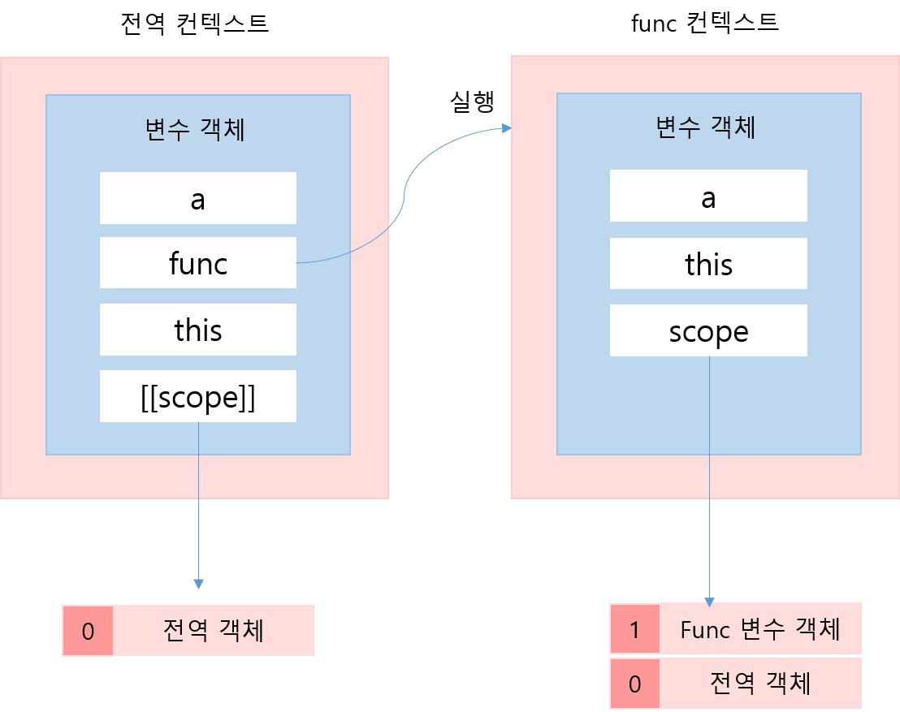

# 호이스팅


``` javascript
var a = "global";

function func () {
    console.log(a);
    
    var a = "local";
    
    console.log(a);
}

func();
```

``` javascript
[실행결과]
undefined
local
```

나는 위의 코드가 이해되지 않았다.  왜냐하면 위의 코드가 실행되면 func 실행 컨텍스트는 스코프체인으로 전역 객체에 접근이 가능하기때문이다. 그래서 당연히 func() 함수의 첫번째 console.log(a)에서 global이 찍힐 줄 알았다. 하지만 undefined가 출력되었다. 정말 이해가 되지않았다. 대체 무슨 이유로 전역변수 a에 접근하지 못하는 것일까 한참 고민했다. 내가 생각한 그림은 아래와 같았다. 




 func() 함수안에서 첫번째 console.log(a)를 찍을 때 변수 a는 아직 선언되지않았으니까 전역 객체의 a를 출력하겠지? 라고 생각했었다.  하지만 내 예상과는 달랐다.  고민을 하다가 혹시 호이스팅때문에 func() 함수보다 전역변수 a의 초기화가 나중에 이루어졌기때문에 변수 a에 undefined값이 찍히는 걸까?라는 생각이 들었다.  그래서 함수선언문이아닌 함수표현식으로 코드를 수정해봤다.

``` javascript
var a = "global";

var func = function() {
    console.log(a);
    
    var a = "local";
    
    console.log(a);
}

func();
```

``` javascript
[실행결과]
undefined
local
```

결과는 똑같았다.  이 문제가 아니었다. 그래서 내가 스코프체이닝에대해 잘못 이해를 하고 있는가 보다해서 실행컨텍스트와 스코프와 스코프체이닝에 대해 다시 찾아보았다.  그러다가 코드를 아래처럼 바꿔서 실행해보았다. 

``` javascript
var a = "global";

function func () {
    console.log(a);
}

func();
```

``` javascript
[실행결과]
global
```

이번엔 undefined가 나올꺼라고 예상했는데 global이 찍혀버렸다.그렇다 난 여기서 깨달았다. func() 함수 내부에서 일어나는 호이스팅때문에 undefined라는 값이 찍힌것이었다!  그리고 func() 함수에 변수 a 가 있기때문에 전역객체까지 탐색을 하지않은 것이다.

``` javascript
var a = "global";

var func = function() {
    var a; 			// undefined
    
    console.log(a);
    
    a = "local";	
    
    console.log(a);
}

func();
```


